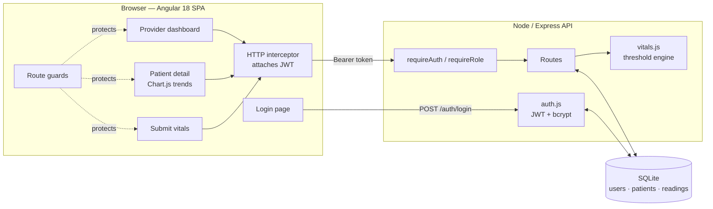

# RPM Platform — Remote Patient Monitoring

A full-stack **Angular + Node/Express** application for remote patient monitoring (RPM). Patients submit vital signs; providers get a live dashboard with threshold-based alerts and interactive 14-day trend charts.

Built as a portfolio piece for health-tech freelance work. Features **JWT authentication with provider/patient roles**, a **SQLite database**, and **Chart.js** trend visualizations.

---

## What it does

- **Authentication & roles** — JWT login. **Providers** see every patient; **patients** see and submit only their own data. Routes are guarded on both the client and the API.
- **Provider dashboard** — all enrolled patients, sorted sickest-first, with an active-alerts strip. Each card shows the latest BP, heart rate, SpO₂, and glucose at a glance.
- **Patient detail** — interactive Chart.js trend charts for every vital, each with dashed normal-range threshold lines, plus a full reading-history table.
- **Submit vitals** — records a reading and instantly evaluates it against clinical thresholds, returning `normal` / `warning` / `critical` with flagged metrics.
- **Alerting engine** — thresholds are defined once in `backend/vitals.js` and drive every status badge, alert, and chart color across the app.

## Demo accounts

| Role | Username | Password | Sees |
|------|----------|----------|------|
| Provider | `dr.chen` | `provider123` | All patients + alerts |
| Patient | `pt-1002` | `patient123` | Only their own record (Marcus Bell) |

Every seeded patient also has a login: username = their patient id (`pt-1001` … `pt-1006`), password `patient123`.

## Architecture



```
rpm-platform/
├── docker-compose.yml       One-command stack (docker compose up --build)
├── backend/                 Node + Express REST API
│   ├── server.js            Routes + role-scoped authorization
│   ├── auth.js              bcrypt hashing, JWT sign/verify, middleware
│   ├── db.js                SQLite (better-sqlite3): schema, seed, queries
│   ├── vitals.js            Vital definitions + threshold logic (single source of truth)
│   ├── seed.js              Generates 6 demo patients × 14 days of readings
│   ├── Dockerfile
│   └── tests/               Jest + supertest (vitals.test.js, api.test.js)
└── frontend/                Angular 18 (standalone components, lazy routes)
    ├── src/app/
    │   ├── core/            models, api.service, auth.service, auth.interceptor,
    │   │                    auth.guard (+ .spec.ts tests)
    │   ├── shared/          line-chart.component.ts (Chart.js wrapper)
    │   └── pages/           login / dashboard / patient-detail / submit-vitals
    ├── Dockerfile + nginx.conf
    └── jest.config.js
```

**API endpoints**

| Method | Path | Auth | Purpose |
|--------|------|------|---------|
| POST | `/api/auth/login` | — | Exchange credentials for a JWT |
| GET  | `/api/auth/me` | any | Current user from token |
| GET  | `/api/patients` | provider | List patients + latest reading |
| GET  | `/api/alerts` | provider | Active alerts |
| GET  | `/api/patients/:id` | provider or that patient | Patient + full history |
| POST | `/api/patients/:id/vitals` | provider or that patient | Submit a reading |
| GET  | `/api/vital-defs` | any | Vital labels, units, normal ranges |

## Running it locally

Requires Node.js 18+. Open two terminals.

**1 — Backend** (port 3000)
```bash
cd backend
npm install
npm start          # creates & seeds rpm.db on first run
```

**2 — Frontend** (port 4200)
```bash
cd frontend
npm install
npm start          # open http://localhost:4200
```

To wipe and reseed the database: `npm run reset-db` in `backend/`.

## Run with Docker (one command)

With Docker Desktop installed, from the `rpm-platform/` folder:

```bash
docker compose up --build
```

This builds both images and starts the stack — frontend at **http://localhost:4200** (served by nginx), API at **http://localhost:3000**. Stop with `Ctrl+C`; `docker compose down` removes the containers.

## Testing

**Backend** (Jest + supertest — thresholds, auth, and role-scoped routes):
```bash
cd backend
npm test
```
API tests run against an in-memory SQLite database, so they never touch `rpm.db`.

**Frontend** (Jest via jest-preset-angular — AuthService + route guards):
```bash
cd frontend
npm test
```

## Clinical thresholds (demo defaults)

| Vital | Warning outside | Critical outside |
|-------|-----------------|------------------|
| Systolic BP | 90–140 mmHg | 80–160 mmHg |
| Diastolic BP | 60–90 mmHg | 50–100 mmHg |
| Heart rate | 50–100 bpm | 40–120 bpm |
| SpO₂ | 92–100 % | 88–100 % |
| Glucose | 70–180 mg/dL | 54–250 mg/dL |
| Temperature | 36.1–37.8 °C | 35–39.4 °C |

Illustrative defaults — real deployments set per-patient thresholds with clinician input.

## Security notes & production path

- **Secrets:** the JWT secret defaults to a dev value in `auth.js`. Set `JWT_SECRET` (and `PORT`) via environment variables in production.
- **Passwords** are hashed with bcrypt; tokens expire after 8h.
- **Database:** SQLite is used for a zero-config demo. The query layer in `db.js` is small and swappable for Postgres (via Prisma/Knex) with no API changes.
- **HIPAA:** serve over TLS, encrypt PHI at rest, log all access for audit, and host under a signed BAA (AWS/Azure/GCP healthcare tiers).
- **Real-time & devices:** push alerts over WebSockets/SSE, and ingest from BLE/cellular home devices (BP cuffs, pulse oximeters, glucometers) instead of manual entry.

## Notes

- No real PHI — all patient data is synthetic.
- Frontend uses standalone components, lazy-loaded routes, a functional HTTP interceptor, and signals for auth state.
